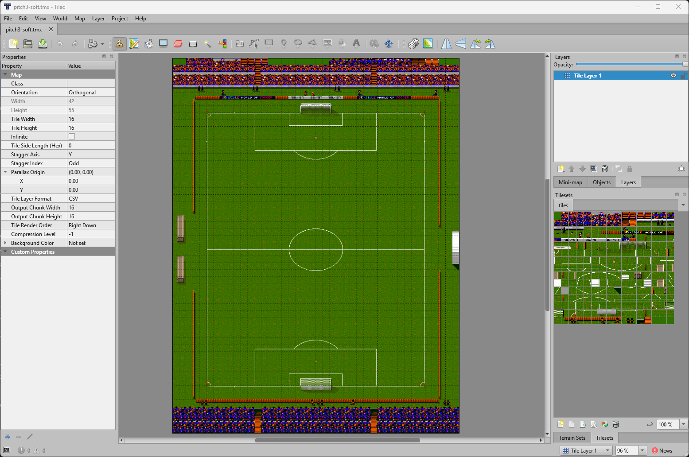
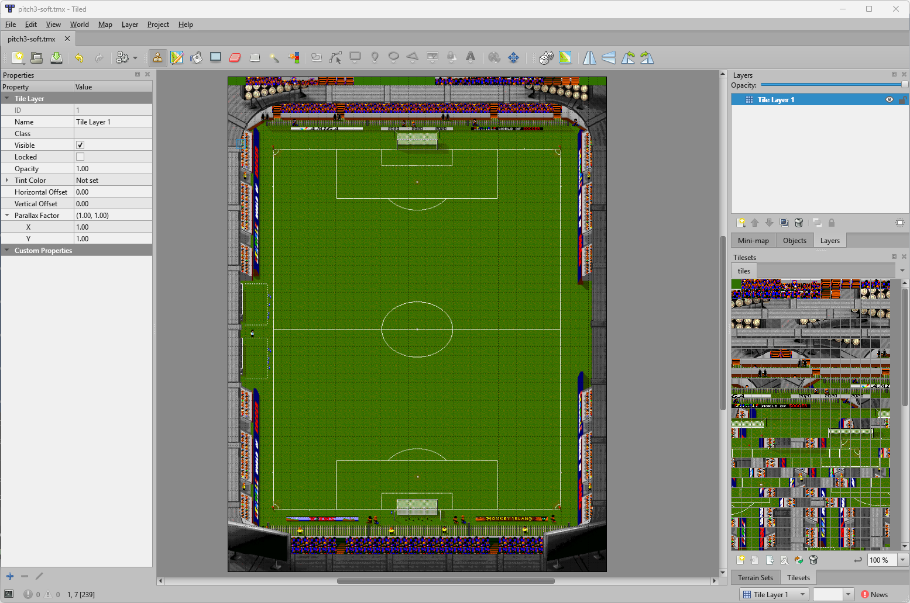

# SwosGfx
Tool for generating or extracting graphics data and palettes for SWOS (Amiga and DOS).

### Screenshots





---

## Amiga usage

### Explicit input/output (two positional args)

```bash
SwosGfx -amiga -map -output=bmp  [-palette=<name>] [-bitplanes=N] [-no-rnc] in.map out.bmp
SwosGfx -amiga -map -output=tmx  [-palette=<name>] [-bitplanes=N] [-no-rnc] in.map out.tmx
SwosGfx -amiga -tmx -output=map  [-bitplanes=N]    [-no-rnc]      in.tmx out.map
SwosGfx -amiga -bmp -output=map  [-bitplanes=N]    [-no-rnc]      fullPitch.bmp out.map
SwosGfx -amiga -bmp -output=raw  [-palette=<name>] [-bitplanes=N] [-no-rnc] in.bmp out.raw
SwosGfx -amiga -raw -output=bmp  [-palette=<name>] [-bitplanes=N] [-no-rnc] in.raw out.bmp
````

### Batch mode (0 or 1 positional arg)

In batch mode, input comes from the Amiga directory (`./Amiga` by default, or `-amiga-dir=<path>`).

* **0 args**: output goes to the current directory
* **1 arg**: treated as an output directory

Supported batch conversions:

```bash
SwosGfx -amiga -raw -output=bmp  [-palette=<name>] [-bitplanes=N] [-no-rnc] [outDir]
SwosGfx -amiga -map -output=bmp  [-palette=<name>] [-bitplanes=N] [-no-rnc] [outDir]
SwosGfx -amiga -map -output=tmx  [-palette=<name>] [-bitplanes=N] [-no-rnc] [outDir]
```

---

## DOS usage

### DOS pitch rendering (patterns from `./DOS`)

In DOS pitch mode, input is implicit from the DOS directory (`./DOS` by default, or `-dos-dir=<path>`).

This mode renders **all 6 pitches** (`pitch1..pitch6`) using the selected type.

* **0 args**: output goes to the current directory
* **1 arg**: treated as an output directory

```bash
SwosGfx -dos -output=bmp [-pitch=N] [-type=normal] [-colors=N] [outDir]
SwosGfx -dos -output=tmx [-pitch=N] [-type=normal] [-colors=N] [outDir]
```

Output filenames:

* BMP: `pitchN-<type>.bmp`
* TMX: `pitchN-<type>.tmx`

Where `<type>` is one of: `frozen, muddy, wet, soft, normal, dry, hard`.

Note: `-pitch` currently exists as an option, but the current implementation renders pitches `1..6` in a loop.

---

### DOS picture usage (`.256` → BMP)

```bash
SwosGfx -dos -picture -output=bmp in.256 out.bmp
```

---

### DOS sprite usage (SPRITE.DAT + *.DAT from `./DOS`)

#### Export all sprites to BMP

* **0 args**: output to current directory
* **1 arg**: treated as output directory

```bash
SwosGfx -dos -sprites-export [-sprite-bg=N] [-output=bmp] [outDir]
# writes sprNNNN.bmp, 0 <= N < 1334
```

#### Import sprites from a directory and update DAT/SPRITE.DAT

```bash
SwosGfx -dos -sprites-import spritesDir
# reads sprNNNN.bmp, inserts and saves changes to DAT/SPRITE.DAT
```

---

## Directories

* Amiga graphics files: `./Amiga` (default, can be changed with `-amiga-dir=<path>`)

  * Pitch files: `SWCPICH1.MAP`, `SWCPICH2.MAP`, `SWCPICH3.MAP`, `SWCPICH4.MAP`, `SWCPICH5.MAP`, `SWCPICH6.MAP`, `SWCPICH7.MAP`
  * Raw files: `CHARSET.RAW`, `CJCBENCH.RAW`, `CJCBITS.RAW`, `CJCGRAFS.RAW`, `CJCTEAM1.RAW`, `CJCTEAM2.RAW`, `CJCTEAM3.RAW`, `CJCTEAMG.RAW`, `DISK22.RAW`, `LOADER00.RAW`, `LOADER01.RAW`, `LOADER1.RAW`, `LOADER10.RAW`, `LOADER2.RAW`, `LOADER3.RAW`, `LOADER4.RAW`, `LOADER5.RAW`, `LOADER6.RAW`, `LOADER7.RAW`, `LOADER8A.RAW`, `LOADER8B.RAW`, `LOADER9.RAW`, `MENUBG.RAW`, `MENUBG2.RAW`, `MENUS.RAW`, `MENUS2.RAW`, `OLDDISK1.RAW`, `SOCCER_S.RAW`

* DOS graphics files: `./DOS` (default, can be changed with `-dos-dir=<path>`)

  * Pitch maps: `PITCH1.DAT`, `PITCH2.DAT`, `PITCH3.DAT`, `PITCH4.DAT`, `PITCH5.DAT`, `PITCH6.DAT`
  * Pitch data: `PITCH1.BLK`, `PITCH2.BLK`, `PITCH3.BLK`, `PITCH4.BLK`, `PITCH5.BLK`, `PITCH6.BLK`
  * Picture files: `TITLE.256`, `SCORES.256`, `LOADSCR.256`
  * Sprite files: `SPRITE.DAT`, `CHARSET.DAT`, `SCORE.DAT`, `TEAM1.DAT`, `TEAM3.DAT"`, `GOAL1.DAT`, `GOAL1.DAT`, `BENCH.DAT`

---

## Common options

```text
-amiga                    Amiga mode (default)
-dos                      DOS mode
-amiga-dir=<path>         Amiga directory (default: ./Amiga)
-dos-dir=<path>           DOS directory (default: ./DOS)

# Amiga input types
-map | -tmx | -bmp | -raw Input type (Amiga only)

-output=bmp|tmx|map|raw   Output type

-palette=<name>           Palette (Amiga): Soft, Muddy, Frozen, Dry, Normal, Hard, Wet
-bitplanes=N              Bitplanes 1-8 (default 4; 4=16 colors, 8=256)
-no-rnc                   Disable RNC compression for Amiga MAP/RAW outputs

# DOS pitch options
-pitch=N                  DOS pitch index (0..MaxPitch-1), default 0
-type=name                DOS pitch type: frozen, muddy, wet, soft, normal, dry, hard
-colors=N                 DOS: remap to N colors (16-256)

# DOS mode switches
-picture                  DOS: operate on a .256 picture file
-sprites-export           DOS: export all sprites to sprNNNN.bmp files
-sprites-import           DOS: import sprNNNN.bmp files into DAT/SPRITE.DAT
-sprite-bg=N              DOS sprites: menu palette index for background color (in BMP slot 16)

# General
-h, -?                    Show help
```

---

## Bitplanes (optional, default 4)

```text
4 = 16 colors
5 = 32 colors
6 = 64 colors
7 = 128 colors
8 = 256 colors
```

---

## Raw formats

```text
320x256 pixels, planar, left-to-right, top-to-bottom
352x272 pixels, planar, left-to-right, top-to-bottom
```

---

## Palette export

*(no input/output files; writes multiple files to the current directory)*

```bash
SwosGfx -palettes
    [-pal-color=amiga12|rgb32]                 # default: amiga12
    [-pal-file=asm|c|palette]                  # default: asm
    [-pal-count=16|128|256]                    # default: 16
    [-pal-full]                                # default: only pitch-affected colors for pitches
    [-pal-format=act|mspal|jasc|gimp|paintnet]  # for -pal-file=palette, default: act
```

---

## Examples

```bash
# Render all DOS pitches as BMP, NORMAL type, remapped to 128 colors, output to ./dos-pitches
SwosGfx -dos -dos-dir=DOS -output=bmp -type=normal -colors=128 dos-pitches

# Convert a DOS pitch BMP into an Amiga pitch MAP with 7 bitplanes (AGA, 128 colors)
SwosGfx -amiga -bmp -output=map -bitplanes=7 dos-pitches/pitch1-normal.bmp SWCPICH1.MAP

# Convert the Amiga pitch MAP back to an AGA BMP using the selected palette
SwosGfx -amiga -map -output=bmp -palette=Normal -bitplanes=7 SWCPICH1.MAP pitch1-amiga-aga.bmp

# Export all palettes (Menu + Game + all pitch types) as 256-color ACT files
SwosGfx -palettes -pal-color=rgb32 -pal-file=palette -pal-count=256 -pal-full -pal-format=act
```

### More Amiga examples

```bash
# Convert an Amiga full-pitch BMP (16 colors) to .MAP using 4 bitplanes
SwosGfx -amiga -bmp -output=map -bitplanes=4 fullPitch.bmp SWCPICH1.MAP

# Convert a RAW 320x256 planar dump to BMP using the "Normal" pitch palette (16 colors)
SwosGfx -amiga -raw -output=bmp -palette=Normal -bitplanes=4 pitch.raw pitch-normal.bmp

# Convert a Tiled .tmx back to Amiga .MAP (7 bitplanes for AGA)
SwosGfx -amiga -tmx -output=map -bitplanes=7 pitch1-aga.tmx SWCPICH1.MAP
```

### More DOS examples

```bash
# Convert a DOS .256 picture to BMP
SwosGfx -dos -picture -output=bmp TITLE.256 title-screen.bmp

# Export all DOS sprites as BMPs using menu color index 0 as the background
SwosGfx -dos -sprites-export -dos-dir=DOS -sprite-bg=0 sprites-out

# Import edited sprNNNN.bmp files back into DAT/SPRITE.DAT
SwosGfx -dos -sprites-import sprites-out
```

### DOS TMX examples

```bash
# Render all DOS pitches, SOFT type, directly to Tiled .tmx files
SwosGfx -dos -dos-dir=DOS -output=tmx -type=soft -colors=128 pitches-soft-tmx

# Render all DOS pitches, DRY type, full 256 colors, directly to Tiled .tmx files
SwosGfx -dos -dos-dir=DOS -output=tmx -type=dry -colors=256 pitches-dry-256-tmx
```

### Amiga TMX examples

```bash
# Convert an Amiga .MAP pitch (AGA, 7 bitplanes) to a Tiled .tmx map
SwosGfx -amiga -map -output=tmx -palette=Normal -bitplanes=7 SWCPICH1.MAP pitch1-normal-aga.tmx

# Same, but OCS/ECS 16-color pitch using 4 bitplanes
SwosGfx -amiga -map -output=tmx -palette=Soft -bitplanes=4 SWCPICH2.MAP pitch2-soft-ecs.tmx

# Take a TMX edited in Tiled and convert it back into an Amiga .MAP (AGA)
SwosGfx -amiga -tmx -output=map -bitplanes=7 pitch1-normal-aga-edited.tmx SWCPICH1.MAP
```

---

## Credits

- [benbaker76](https://github.com/benbaker76/) - for writing the software, updating and maintaining it
- [starwindz](https://github.com/starwindz/) - author of [bmp-to-raw-for-amiga-swos](https://github.com/starwindz/bmp-to-raw-for-amiga-swos)
- [zlatkok](https://github.com/zlatkok) - author of [swpe](https://github.com/zlatkok/swos-port/tree/master/tools/swpe)
